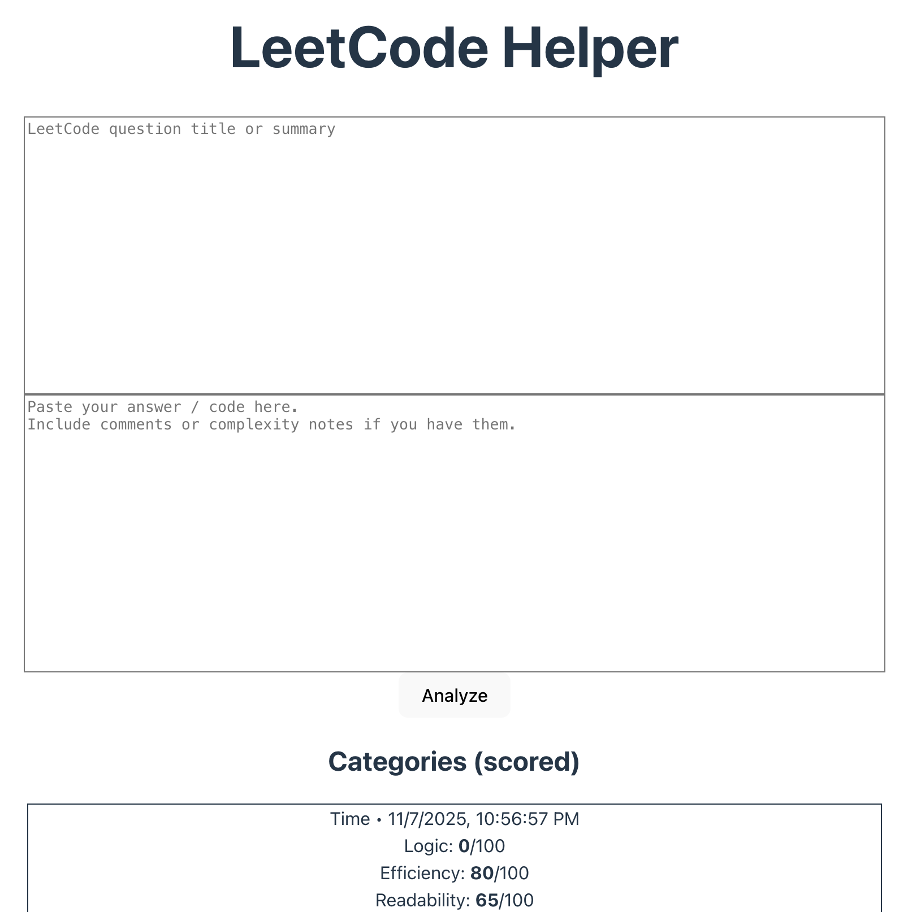

# LeetCode Helper

LeetCode Helper is an intelligent coding assistant that helps programmers evaluate their LeetCode solutions with instant AI-driven feedback. By analyzing submitted code through GPT, it provides insights into logic, efficiency, and readability — empowering developers to continuously improve their problem-solving and coding quality.

  

## Features

### Code Evaluation Categories
1. Logic – Checks the correctness and reasoning behind the solution.  
2. Efficiency – Evaluates the algorithm’s performance and complexity.  
3. Readability – Reviews code clarity, naming, and structure for maintainability.

### Inputs
- Question – The original LeetCode problem statement.  
- Answer – The programmer’s code solution.

### Outputs
The system generates feedback data across:
- Logic
- Efficiency
- Readability
- Time (timestamp or duration of evaluation)

## How It Works

1. The user inputs a LeetCode question and their solution code.  
2. The system sends both inputs to GPT for analysis.  
3. GPT provides structured feedback in the above categories.  
4. Developers can track and compare their performance over time.

## Tech Stack (Example)
- Frontend: React / Next.js  
- Backend: Node.js / Express  
- AI Integration: GPT API  
- Database: MongoDB / Firebase  

## Example Output
{
  "logic": "Good approach, but fails for edge cases when input is null.",
  "efficiency": "O(n^2) time complexity. Consider using a hashmap for optimization.",
  "readability": "Variable names are descriptive, but indentation is inconsistent.",
  "time": "2025-11-07T10:15:00Z"
}

## Goal

To make LeetCode practice more effective by turning every solution into a learning opportunity — helping developers not just solve problems, but write better, cleaner, and faster code.
